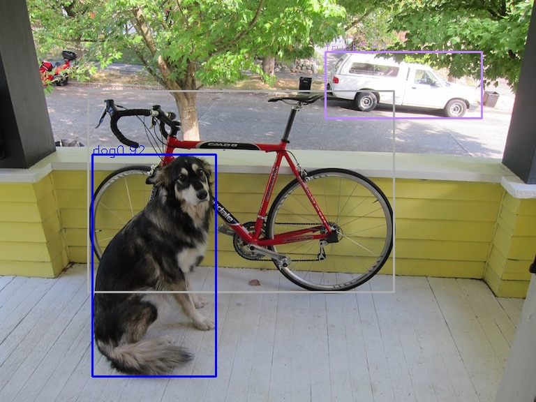
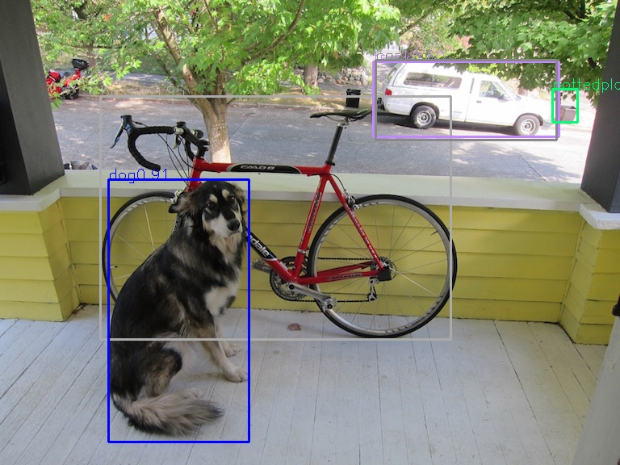
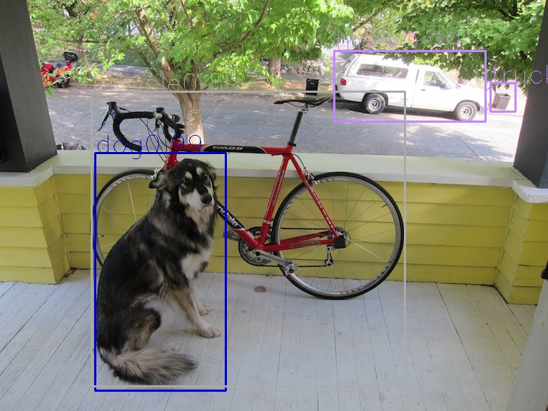

# smoke_monitoring
**Final goal:**

classify and detect smoke、deploying model with onnx 

use c++ 11 features、threadpool and http in this project in order to make this project usefull.

**Intermediate target：**

Implement some classic and start of art networks.

**1、Classify:**

This type of network is the easiest to implement, so we just get the onnx model,call the forward,then it's over.

Implemented classic network：resnet、inception、desen set、ghost net、resnetxt with ibn、mobile net、sequeeze net、shuffle net、

**2、Detection:**

ori_pic、Yolo、Yolox、Detr

still working...

**3、segmentation**
